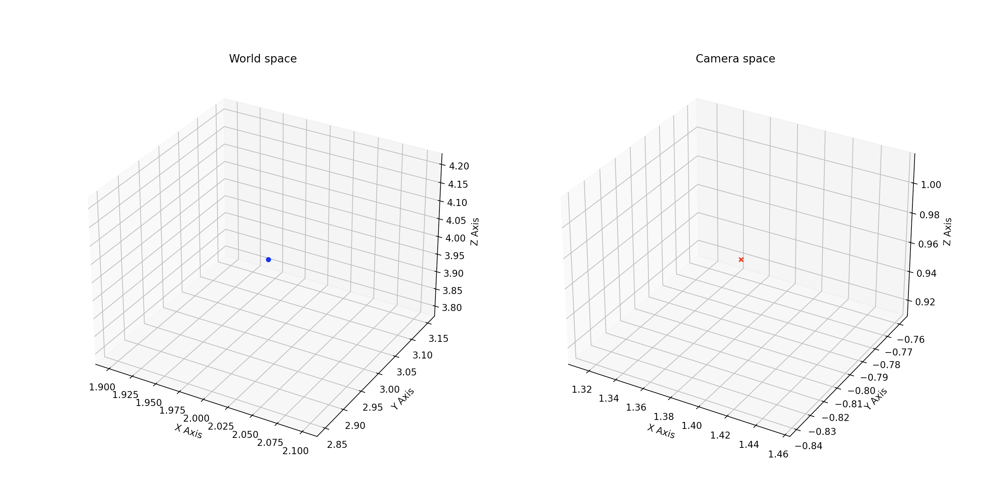

# Homework 1: Camera View Transformation

```
Apoorva Kaushik
October 1, 2022
Virtual and Augmented Reality Homework 1: Camera View Transformation
```

## Object Position and Visualization

```
Object Position in the camera space:
[ 1.38397467 -0.79903796  0.96410142]
```


This is the output of the visualization of where the object is in the world space and camera space.

## General Logic

> Initial camera matrix
$$\begin{bmatrix}
1 & 0 & 0 & 0 \\
0 & 1 & 0 & 0 \\
0 & 0 & 1 & 0 \\
0 & 0 & 0 & 1
\end{bmatrix}$$

> Rotate 120 degrees around the z-axis
$$\begin{bmatrix}
cos(120) & -sin(120) & 0 & 0 \\
sin(120) & cos(120) & 0 & 0 \\
0 & 0 & 1 & 0 \\
0 & 0 & 0 & 1
\end{bmatrix}$$

> Translate by (2, 3, 1)
$$\begin{bmatrix}
1 & 0 & 0 & 2 \\
0 & 1 & 0 & 3 \\
0 & 0 & 1 & 1 \\
0 & 0 & 0 & 1
\end{bmatrix}$$

> Rotate 30 degrees around the x-axis
$$\begin{bmatrix}
1 & 0 & 0 & 0 \\
0 & cos(30) & -sin(30) & 0 \\
0 & sin(30) & cos(30) & 0 \\
0 & 0 & 0 & 1
\end{bmatrix}$$

Multiply the matrices above to get the composite camera transformation. Invert the composite camera transformation and multiply with the objects world position to get the objects camera position. Then visualize the world space and camera space.